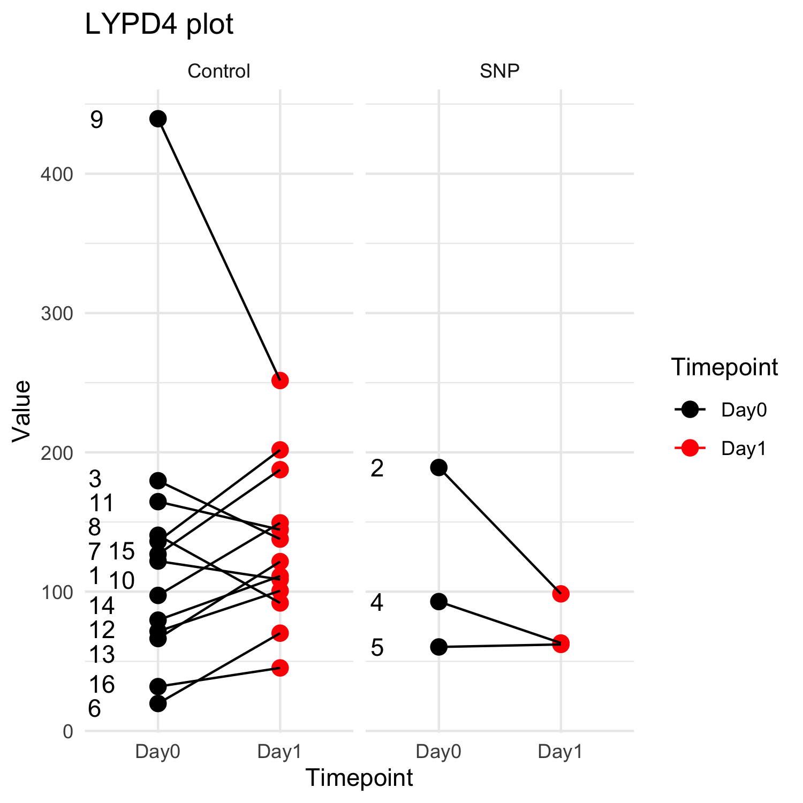

# RNA_diff_gene_analysis
RNA analysis using DESEQ2

Contains both paired t test for longitudinal data analysis and unpaired t test. Contains plots and heatmap. This is again a memo to self but could be useful to others.

the file 'RNAseq_v2p_copy.R' contains the code for paired longitudinal data analysis via paried t test. The sample table is named 'sample_table_paired_ttest.csv'. Meanwhile, the sample table for unpaired t-test is 'sample_table_unpaired_ttest.csv' and the DESEQ2 code is located in 'RNAseq_v6_copy.R'. This code snippet also contains plots and heatmap. The plot looks like the following:

